# Dokumentacja "Koło fortuny - Losowanie osób do różnych celów"

## Table of contents
* [Link do projektu](#link-do-projektu)
* [Demo aplikacji](#demo-aplikacji)
* [Technologie użyte w projekcie](#technologie-użyte-w-projekcie)
* [Lokalna instalacja projektu](#lokalna-instalacja-projektu)
* [Statystyki z firebase](#statystyki-z-firebase)

## Link do projektu
Aplikacja jest dostępna w sieci pod linkiem: https://tpf-pk-proj3.web.app/

## Demo aplikacji

### Dla niezalogowanego użytkownika
Ekran startowy projektu jest dostępny dla niezalogowanych użytkowników i wygląda on następująco: 
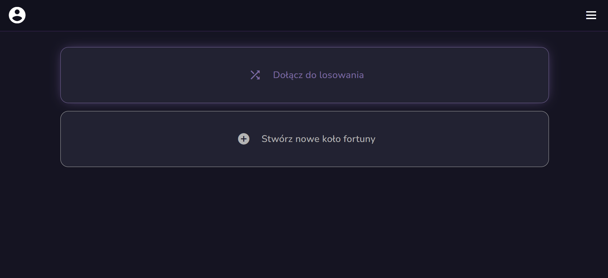

Obecnie nieuwierzytelniony gracz nie posiada żadnej możliwości działania i nie może on stworzyć nowego koła, bądź dołączyć do już istniejącego. Jedyna dostępną funkcją jest możliwość zalogowania się, która jest dostępna w bocznym panelu:

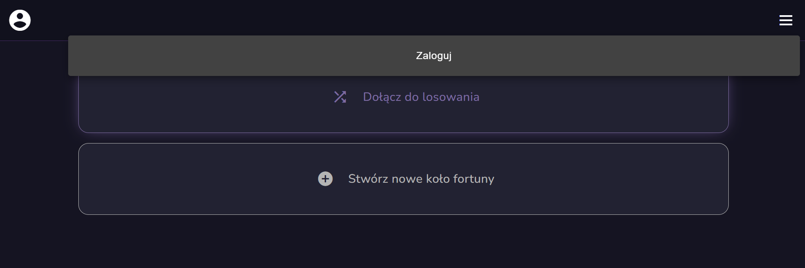

### Logowanie
W przypadku wybrania opcji zaloguj zostaniemy przekierowani na stronę autoryzacji Google. Jeśli nie mamy zapisanego konta to otrzymamy njapierw pole do podania adresu mail, a nastepnie hasła:

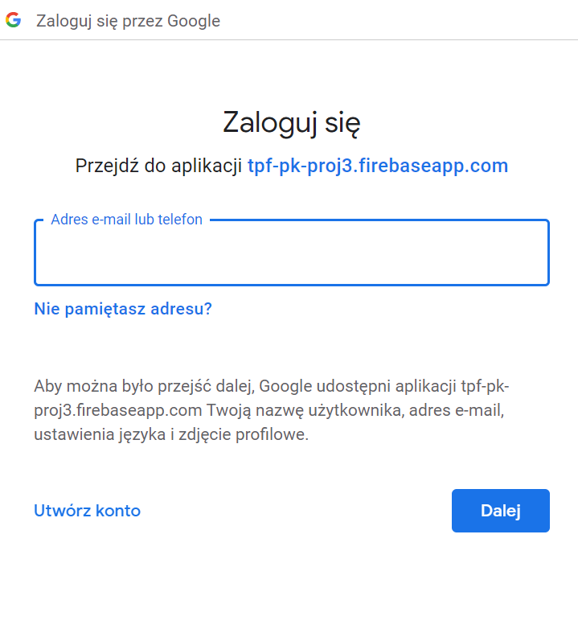

Jeśli jednak posiadamy zapisane konta to otrzymamy podpowiedzi do zalogowania się na konto przez wybór odpowiedniego konta:

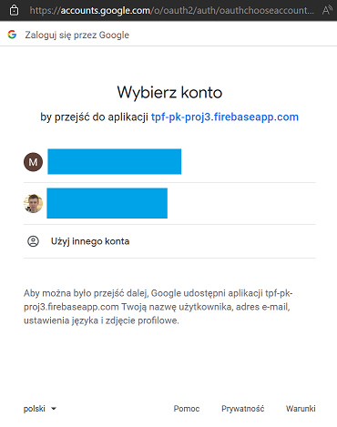

Jeśli jednak z danej przeglądarki następuje już kolejne logowanie to po kliknięciu zaloguj zostaniemy automatycznie uwierzytelnieni.


### Ekran startowy dla zalogowanych użytkowników
Po poprawnym przejściu autentykacji w menu głównym pojawia się zdjęcie użytkownika, które jest wzięte z konta google. Oprócz tego po najechaniu opcji wybory pojawiają się opcje do wylogowania i przejścia do profilu użytkownika

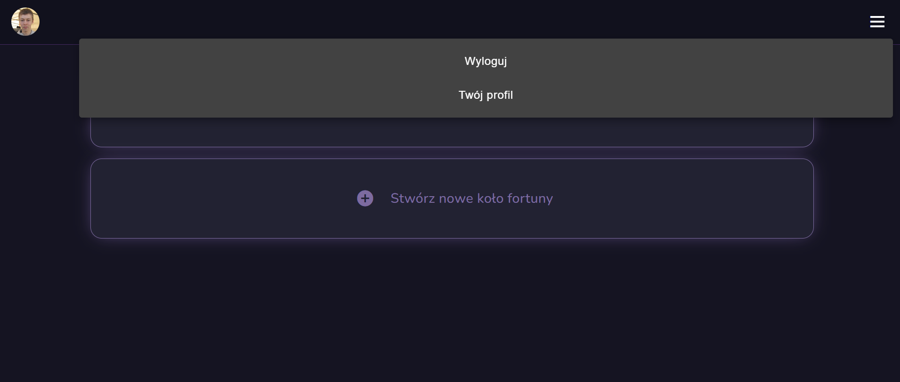


## Profil użytkownika
Profil użytkownika obecnie zawiera podstawowe informacje o użytowniku. Wśród nich są zdjęcie użytkownika oraz imię i nazwisko użytkownika

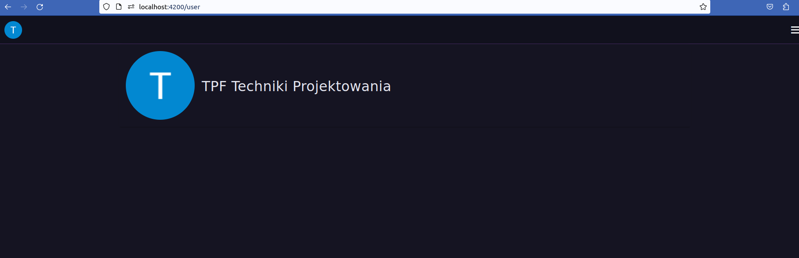

## Tworzenie koła fortuny
Zalogowany uczesnik ma możliwość stworzenia nowego koła. W trakcie tworzenia koła podaje on nazwę koła oraz wybiera czas jednego losowania:

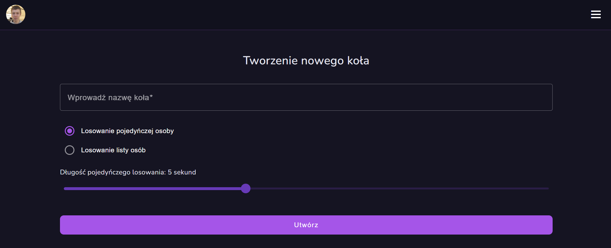

## Wygląd koła fortuny

Po stworzeniu koła fortuny administrator koła zostaje automatycznie do niego przypisane i jako jedyny się na nim znajduje. Ma on możliwość kręcenia kołem poprzez przycisk "Rozpocznij losowanie", który znajduje się pod kołem:

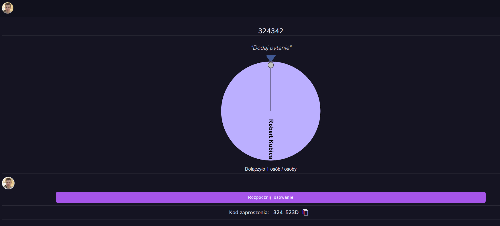

Oprócz tego administrator ma możliwość dodania sobie treści pytania, które pojawia się nad kołem.

Jeśli chodzi o inne funkcje dostępne wraz z kołem to pojawiają się statystyki takie jak ilość osób znajdujących się obecnie na kole.


Oprócz tego pod kołem  znajduje się lista osób, które obecnie znajdują się na kole. Jest ona przedstawiona jako zdjęcia profilowe każdego z uczestnika: 


Ostatnią informacją jaka znajduje się na profilu jest unikalny kod koła, który się nie powtarza i jest znany tylko użytkownikom na kole. Ten kod służy do dołączania nowych graczy do konkretnego koła fortuny:


## Dołączanie do koła 
Zalogowany użytkownik ma róœnież opcje dołączenia samemu do istniejącego już koła fortuny. Żeby dołączyć do koła to potrzebny jest numer istaniejącego koła. W przypadku błędnego kodu do gry to użytkownik nie zostanie dodany do koła. Jednak w przypadku dołączenia nowy użytkownik ma dostępny taki sam panel jak administrator:

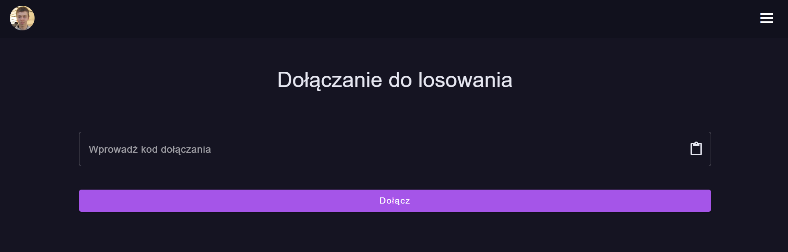

## Losowanie
Po dołączeniu wszystkich osób chętnych to można kliknąć przycisk do zakręcenia. Po określonej wcześniej liczbie sekund następuje komunikat z wylosowaną osobą. Na tym pojawiającym się komunikacie znajdują się takie informacje jak imię i zdjecię wylosowanej osoby oraz temat losowania:

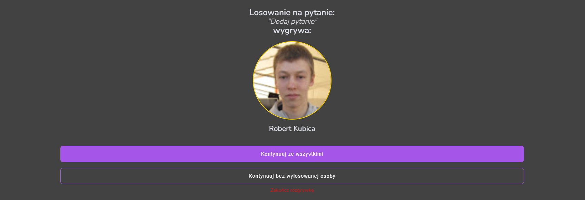


### Kolejne losowanie
Po otrzymaniu wyników z losowania, osoba która losowała może wybrać opcje na kolejne losowanie lub jej brak. Jedną z opcji jest ponowne losowanie, drugie powtórzenie bez wylosowanej już osoby a trzecią jest usunięcie koła.

### Ponowne losowanie
Jest to najbardziej tradycjna opcja. Podczas niej nasßepuje powtórzenie losowaniana grupie wsyztskich obecnych uczestników na kole.

### Losowanie z mniejszą ilością osób
Taka opcja usuwa sposród wyzystkich uczestników obecnie znajdujących się kole dokałdnie jednej osoby. Tą usuniętą osobą jest ta, która została wylosowana w ostatniej rundzie

### Usunięcie koła
Po wybraniu tej opcji osoby są przenoszone do menu głównego.

## Technologie użyte w projekcie
Projekt został zrealizowany poprzez wybrane technologie podczas wywiadu z leaderem. Były to zatem: 
- Angular
- Firebase
- Github 
- HTML
- CSS
- Redux

### Kilka słów o Redux
"Redux to biblioteka Java Script, która służy do zarządzania stanem aplikacji zarówno frameworku React.js, opartego na komponentach, jak i Angular. Stanowi on swoiste rozwinięcie architektury flux – wzorca architektury aplikacji, której główną cechą jest jednokierunkowy przepływ informacji. Opiera się na założeniu, iż każdy stan komponentu jest wynikiem poprzedniego stanu, który został zmodyfikowany przez konkretną akcję, które to założenie umożliwia łatwe testowanie, zapisywanie i wznawianie tego stanu."(https://boringowl.io/tag/redux)

### Emulatory w firebase
"Pakiet emulatorów lokalnych Firebase to zestaw zaawansowanych narzędzi dla programistów, którzy chcą tworzyć i testować aplikacje lokalnie przy użyciu Cloud Firestore, Bazy danych czasu rzeczywistego, Cloud Storage dla Firebase, Uwierzytelniania, Hostingu Firebase, Cloud Functions (beta), Pub/Sub (beta), i rozszerzenia Firebase (beta). Zapewnia bogaty interfejs użytkownika, który pomaga w szybkim uruchomieniu i prototypowaniu."(https://firebase.google.com/docs/emulator-suite?hl=pl)

## Lokalna instalacja projektu
Aby lokalnie zainstalować potrzebne są narzędzia:
- git
- npm: >'8.15.0'
- node: >'16.17.0'

Później kopiujemy repozytorium:
```
$ git clone https://github.com/IncogVito/PK_TPF_PROJ_3.git
``` 

Później przechodzimy do folderu wheel-of-fortune i instalujemy npm
```
$ cd wheel-of-fortune/
$ npm install
```

Po zainstalowaniu możemy uruchomić aplikację:
```
$ npm start
```

Następnie w nowym terminalu uruchamiamy emulatory firebase:
```
$ firebase emulators:start --project tpf-pk-proj3
```
Po wykonaniu wszystkich komend możemy sprawdzić, czy aplikacja jest włączona: http://localhost:4200/ 

## Statystyki z firebase
### Hosting
Domeny dostępne dla projektu:

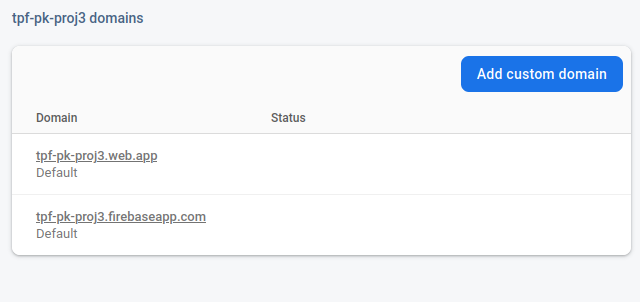

### Użytkownicy
W statystykach możemy znaleźć informację na temat użytkowinków. Wśród nich możemy poznać identyfikator i sposób uwierzytelniania oraz informację na temat ostatniego logowania w aplikacji

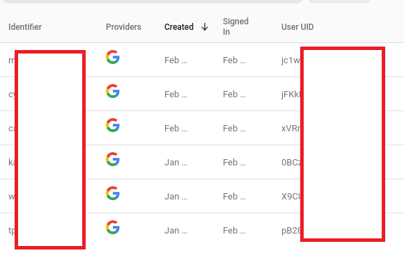

### Aktywność
W firebasie można śledźić statystyki dotyczące ilości użytkowników i logowań w przeszłości. Pozwala to zbadać zainteresowanie klienta aplikacją

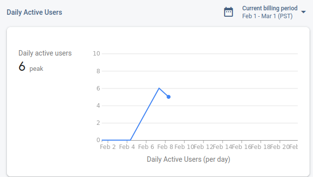

### Bazy danych
W Firebasie jest możliwość przechowywania baz danych. W podanym projekcie przechowujemy wszystkie aktywne gry, gdzie w każdej grze posiadamy informacje na temat użytkowników, daty utworzenia, kodu dołączenia itp.

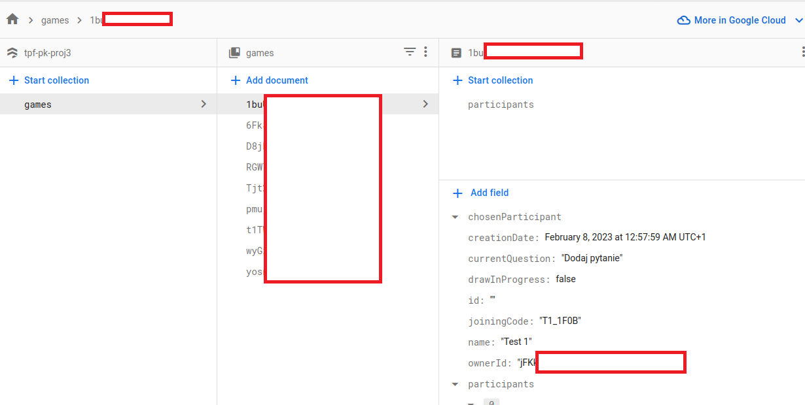